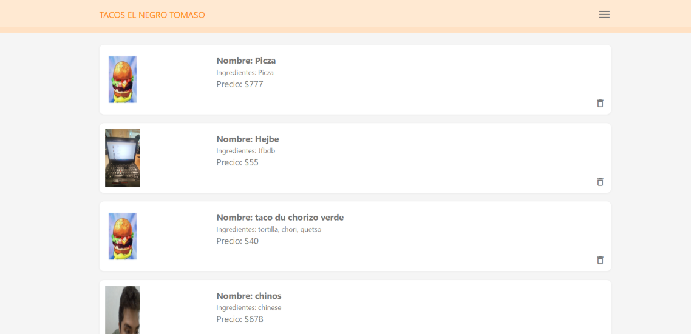
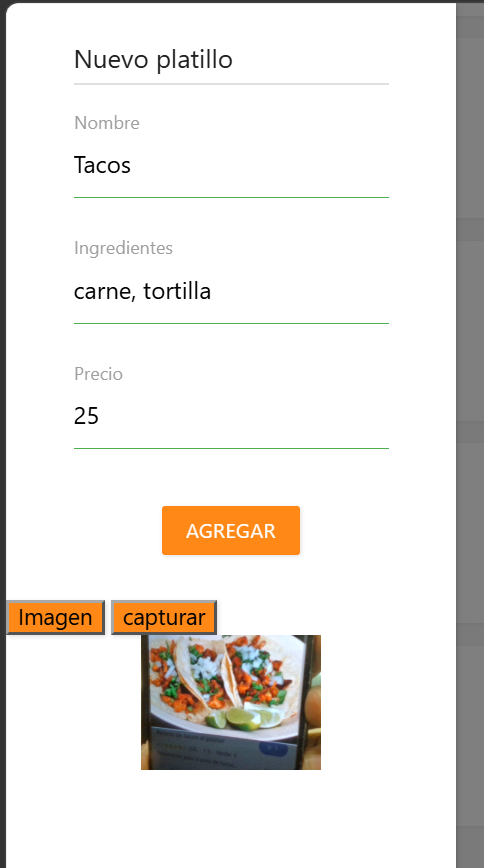
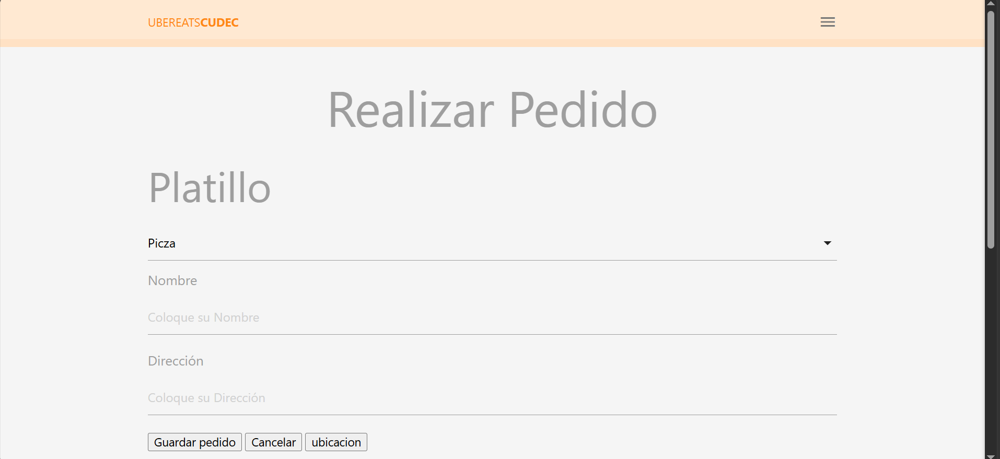
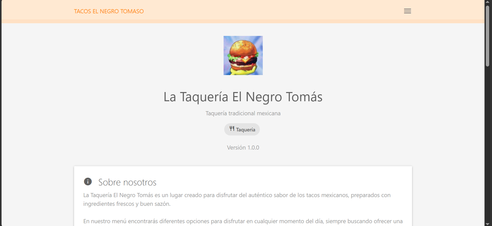
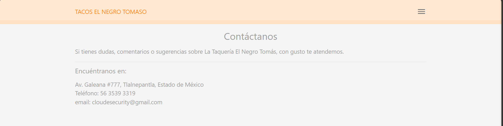

# La Taquería El Negro Tomaso

**Tipo de aplicación:** PWA (Progressive Web App)
**Versión:** 1.0.0
**Descripción:** Aplicación web progresiva para la consulta del menú y gestión de pedidos de **La Taquería El Negro Tomaso**, una taquería tradicional mexicana.

**Materia:** Programacion Avanzada 2
**Carrera:Ing en sistemas computacionales
**Alumno:** Kevin David Carrillo Montoya
**Grupo:** 09ISC181
**Institución:** Cudec

---

# 1. Título del proyecto

## La Taquería El Negro Tomaso

**Tipo de aplicación:** PWA (Progressive Web App)

**La Taquería El Negro Tomaso** es una aplicación web progresiva desarrollada para ofrecer a los clientes una forma rápida, sencilla y accesible de consultar información del restaurante, conocer sus productos y realizar pedidos.

La aplicación representa digitalmente una taquería tradicional mexicana especializada en tacos al pastor, quesadillas y aguas frescas, ofreciendo también servicios de pedidos para llevar y servicio a domicilio.

**Versión:** 1.0.0

---

# 2. Descripción del proyecto

La Taquería El Negro Tomaso es un establecimiento dedicado a ofrecer comida tradicional mexicana, utilizando ingredientes frescos y recetas que buscan conservar el sabor característico de una taquería tradicional.

El proyecto consiste en desarrollar una aplicación web progresiva que permita digitalizar parte de los servicios del restaurante. A través de la aplicación, los usuarios pueden consultar información sobre la taquería, conocer sus especialidades, registrar platillos y realizar pedidos.

La aplicación está dirigida principalmente a los clientes de la taquería que desean consultar el menú y realizar sus pedidos de una manera rápida y sencilla desde un dispositivo móvil o computadora.

El propósito principal es proporcionar una herramienta digital que facilite la realización de pedidos y mejore la experiencia del cliente, además de presentar información importante como horarios, servicios, ubicación y medios de contacto.

---

# 3. Objetivos

## Objetivo general

Desarrollar una aplicación web progresiva para **La Taquería El Negro Tomaso** que permita a los usuarios consultar información del restaurante, conocer los productos disponibles y realizar pedidos de manera rápida, sencilla y accesible desde diferentes dispositivos.

## Objetivos específicos

* Diseñar una interfaz gráfica sencilla, atractiva y fácil de utilizar.
* Presentar información general de La Taquería El Negro Tomaso.
* Mostrar las principales especialidades y productos disponibles.
* Permitir el registro de nuevos platillos.
* Facilitar la selección de productos para realizar un pedido.
* Permitir la realización y confirmación de pedidos.
* Mostrar la información del pedido una vez finalizado.
* Proporcionar los horarios de atención del restaurante.
* Mostrar la información de contacto y ubicación.
* Dar a conocer los servicios de la taquería.
* Implementar la aplicación utilizando el modelo de Progressive Web App.
* Facilitar el acceso a la aplicación desde dispositivos móviles y computadoras.

---

# 4. Características principales

La aplicación cuenta con las siguientes características y funcionalidades:

### Página de inicio

Presenta la información principal de **La Taquería El Negro Tomaso**, incluyendo una descripción del establecimiento y sus principales productos.

### Registro de platillos

Permite registrar nuevos platillos para incorporarlos a la información disponible dentro de la aplicación.

### Realización de pedidos

El usuario puede seleccionar los productos que desea consumir y generar un pedido.

### Confirmación del pedido

Una vez realizado el pedido, la aplicación muestra la información correspondiente para que el usuario pueda verificar los productos seleccionados.

### Acerca de

Presenta información sobre **La Taquería El Negro Tomaso** y el propósito de la aplicación.

### Contacto

Permite consultar los datos de contacto del restaurante:

* **Dirección:** Av. Galeaa #777, Tlalnepantla de Baz, EdoMex.
* **Teléfono:** 56 3539 3319.
* **Correo electrónico:** cloudesecurity@gmail.com.

### DB

* Conexión con **Firebase Firestore** para almacenamiento de datos

### PWA

La aplicación está desarrollada como una **Progressive Web App**, permitiendo que pueda ser utilizada desde un navegador y contar con características propias de una aplicación web progresiva.

---

# 5. Tecnologías utilizadas

Para el desarrollo de **La Taquería El Negro Tomaso** se utilizaron las siguientes tecnologías:

* **HTML5:** Utilizado para crear la estructura y contenido de las páginas.
* **CSS3:** Utilizado para el diseño, estilos y presentación visual de la aplicación.
* **JavaScript:** Utilizado para implementar la lógica y funcionalidades de la aplicación.
* **Materialize CSS:** Framework utilizado para facilitar el diseño de la interfaz y los componentes visuales.
* **PWA (Progressive Web App):** Tecnología utilizada para proporcionar características de aplicación web progresiva.
* **Service Worker:** Utilizado para administrar recursos y permitir funcionalidades relacionadas con el funcionamiento de la PWA.
* **Web App Manifest:** Archivo utilizado para configurar la aplicación como PWA.
* **Firebase:** Plataforma utilizada para los servicios relacionados con la base de datos y almacenamiento de información del proyecto.


---


# 6. Estructura del proyecto

La estructura del proyecto **La Taquería El Negro Tomaso** está organizada de la siguiente manera:

```
UberEatsCUDEC-Comida
├── .vscode/
│
├── assets/
│
├── css/styles
│
├── img/icons
│
├── js/db, firebase, materialize
│
├── pages/ about, contacto, pedidos
│
├── index.html
│
├── manifest.json
│
├── README.md
│
└── sw.js
```


### Archivos principales


| Archivo         | Descripción                                                      |
| --------------- | ----------------------------------------------------------------- |
| `index.html`    | Página principal de la aplicación.                              |
| `about.html`    | Página con información acerca del restaurante y la aplicación. |
| `contact.html`  | Página con información de contacto.                             |
| `pedidos.html`  | Página relacionada con la realización y gestión de pedidos.    |
| `pedidos.js`    | Contiene la lógica relacionada con los pedidos.                  |
| `db.js`         | Contiene funciones relacionadas con el manejo de datos.           |
| `firebase.js`   | Configuración y conexión con Firebase.                          |
| `manifest.json` | Configuración de la Progressive Web App.                         |
| `sw.js`         | Service Worker utilizado por la PWA.                              |
| `css/`          | Archivos relacionados con los estilos visuales.                   |
| `js/`           | Archivos JavaScript adicionales.                                  |
| `img/`          | Imágenes utilizadas por la aplicación.                          |
| `icons/`        | Íconos utilizados para la aplicación PWA.                       |

---

# 7. Evidencias / capturas de pantalla

A continuación se muestran las principales pantallas de la aplicación.

## Inicio

La pantalla de inicio presenta la identidad de **La Taquería El Negro Tomaso**, su descripción, especialidades, servicios y otra información relevante para el usuario.

**Captura de pantalla:




---

## Registrar platillo

Esta pantalla permite registrar nuevos platillos dentro de la aplicación, proporcionando la información necesaria para incorporarlos al menú.

**Captura de pantalla:**




---

## Realizar pedido

En esta sección el usuario puede seleccionar los productos que desea adquirir y completar el proceso para generar su pedido.

Una vez terminado el proceso, se muestra la información correspondiente al pedido realizado.

**Captura de pantalla:**




---

## Acerca

La sección **Acerca** presenta información sobre la taquería, su concepto y la aplicación desarrollada.

**Captura de pantalla:**




---

## Contacto

La sección **Contacto** permite al usuario consultar la información necesaria para comunicarse con el restaurante.

### Información de contacto

**Dirección:** Av. Galeana #777, Tlalnepantla, EDOMEX

**Teléfono:** 56 3539 3319

**Correo electrónico:** cloudesecurity@gmail.com

**Aplicación:** El Negro Tomaso



---

# 8. Base de datos

## Motor utilizado

El proyecto utiliza **Firebase** para los servicios relacionados con el almacenamiento y manejo de información.

La conexión y configuración del servicio se encuentra relacionada con los archivos:

* `firebase.js`
* `db.js`

La base de datos permite gestionar información necesaria para el funcionamiento de la aplicación, principalmente relacionada con los platillos y pedidos.

## Información almacenada

### Platillos

La información de los platillos permite administrar los productos que pueden ser ofrecidos a los clientes.

Entre la información manejada se encuentra:

* IdPlatillo
* Nombre.
* Ingredientes
* Precio.

### Pedidos

La aplicación permite gestionar la información correspondiente a los pedidos realizados por los usuarios.

Entre los datos relacionados con los pedidos se encuentran:

* Idpedido.
* Platillo
* Nombre
* Direccion

La estructura exacta de los campos puede variar de acuerdo con la configuración utilizada en Firebase.

---

# 9. Licencia

Este proyecto fue desarrollado con fines académicos como parte de la carrera de Ing. en sistemas computacionales, para la materia de programacion avanzada 2, del 09ISC181 en la escuela CUDEC.

El proyecto tiene como finalidad demostrar los conocimientos adquiridos durante el desarrollo de la asignatura y servir como evidencia del trabajo realizado.

### Licencia

**Uso académico y educativo.**

Queda prohibido utilizar este proyecto con fines comerciales sin la autorización de sus autores.
